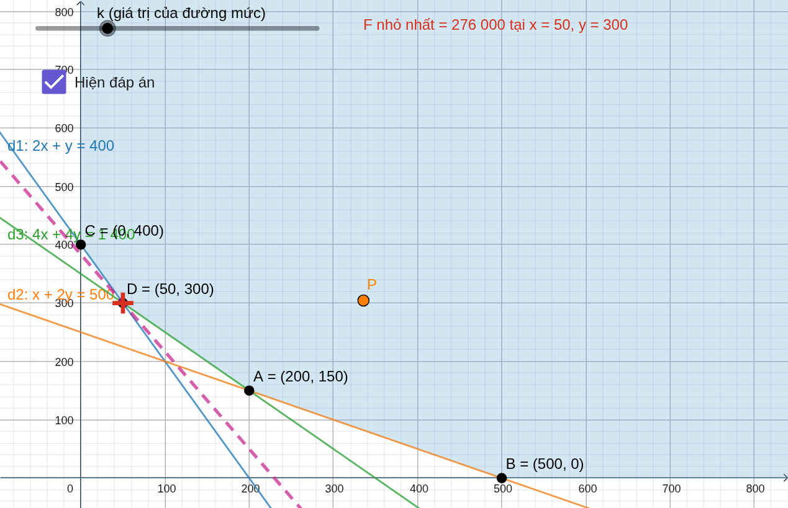

# Mô hình kết hợp GeoGebra – Python trong dạy và học Quy hoạch tuyến tính

Kho học liệu mở của đề tài nghiên cứu khoa học sinh viên **“Phát triển năng lực số cho sinh viên Sư phạm Toán thông qua mô hình kết hợp GeoGebra – Python trong dạy và học nội dung Quy hoạch tuyến tính đáp ứng Chương trình giáo dục phổ thông 2018”** (mã số TSV2026-211), Trường Sư phạm, Đại học Cần Thơ.

- **Nhóm thực hiện:** Đặng Nguyễn Minh Tuân (chủ nhiệm), Trần Thị Tuyết Nhung, Nguyễn Văn Nhẫn, Ngô Trần Duy Thịnh
- **Cán bộ hướng dẫn:** TS. Phạm Thị Vui – Khoa Sư phạm Toán và Tin học, Trường Sư phạm, Đại học Cần Thơ
- **Thời gian thực hiện:** 05/2026 – 10/2026

Kho gồm **3 sổ tay (notebook) Python** chạy trên Google Colab và **9 tệp mô phỏng GeoGebra**. Các tệp GeoGebra được **sinh tự động từ Python**, và mọi kết quả đều được **kiểm chứng chéo** giữa bộ giải Python, GeoGebra và thư viện SciPy.



---

## 1. Notebook Python (Google Colab)

Bấm nút **Open in Colab** để mở và chạy trực tiếp trên trình duyệt, không cần cài đặt. Trong Colab chọn **Runtime ▸ Run all**.

| Notebook | Nội dung | Đối tượng | Mở |
|---|---|---|---|
| `QHTT_THPT_Lop10_Lop12_phuong_phap_hinh_hoc.ipynb` | Bộ giải hình học bài toán QHTT hai ẩn; 9 bài toán lớp 10, chuyên đề lớp 12 và đề thi TN THPT 2025; lời giải 5 bước, hình vẽ, thanh trượt đường mức, lệnh GeoGebra, kiểm chứng | GV, HS THPT, SV | [](https://colab.research.google.com/github/VuiPhamCTU/QHTT-GeoGebra-Python/blob/main/QHTT_THPT_Lop10_Lop12_phuong_phap_hinh_hoc.ipynb) |
| `Chuong1_QHTT_hinh_hoc_don_hinh_BigM_hai_pha.ipynb` | Phương pháp đơn hình, bài toán M (M dạng ký hiệu), hai pha, đơn hình đối ngẫu; so sánh bốn phương pháp trên cùng một bài toán | SV Sư phạm Toán | [](https://colab.research.google.com/github/VuiPhamCTU/QHTT-GeoGebra-Python/blob/main/Chuong1_QHTT_hinh_hoc_don_hinh_BigM_hai_pha.ipynb) |
| `Chuong3_Bai_toan_van_tai.ipynb` | Bài toán vận tải: thuật toán thế vị, bài toán không cân bằng, có ô cấm | SV Sư phạm Toán (mở rộng) | [](https://colab.research.google.com/github/VuiPhamCTU/QHTT-GeoGebra-Python/blob/main/Chuong3_Bai_toan_van_tai.ipynb) |

**Giải bài toán của bạn:** mỗi notebook có mục **Mẫu** ở cuối. Ví dụ với bộ giải hình học:

```python
bt = giai("Bài của tôi", muc_tieu=(3, 2), loai="max",
          rang_buoc=[(1, 1, "<=", 8),      # x + y <= 8
                     (1, 3, "<=", 18),     # x + 3y <= 18
                     (2, 1, "<=", 14)])    # 2x + y <= 14
tuong_tac(bt)        # thanh trượt đường mức
```

Thư viện sử dụng: NumPy, pandas, Matplotlib, SciPy, ipywidgets (Colab có sẵn).

## 2. Tệp mô phỏng GeoGebra

Mở tại [geogebra.org/classic](https://www.geogebra.org/classic): **Menu (☰) ▸ Mở ▸ Mở từ tệp** rồi chọn tệp `.ggb` (hoặc mở bằng phần mềm GeoGebra Classic trên máy tính).

| Tệp | Bài toán | Kết quả | Điểm nhấn |
|---|---|---|---|
| `Bai_2_6_Lop10.ggb` | Mua thịt bò, thịt lợn (Toán 10) | F nhỏ nhất = 251 tại (0,3; 1,1) | Miền bị chặn bởi giới hạn mua |
| `Bai_2_15_Lop10.ggb` | Đầu tư trái phiếu (Toán 10) | F lớn nhất = 96,5 tại (750; 250) | Ba ẩn quy về hai ẩn |
| `Bai_2_16_Lop10.ggb` | Thời lượng quảng cáo (Toán 10) | F lớn nhất = 3 080 tại (200; 360) | |
| `Bai_2_1_Lop12.ggb` | Thuê bàn tiệc cưới (CĐ 12) | F nhỏ nhất = 7 500 tại (0; 25) | Nghiệm nguyên (lưới điểm nguyên) |
| `Bai_2_2_Lop12.ggb` | Sản xuất sữa chua (CĐ 12) | F lớn nhất = 480 000 trên cả cạnh CD | Vô số phương án tối ưu |
| `Bai_2_3_Lop12.ggb` | Hạn mức khí thải (CĐ 12) | F lớn nhất = 34 800 000 tại (700; 400) | |
| `Bai_2_4_Lop12.ggb` | Chế độ ăn (CĐ 12) | F nhỏ nhất = 276 000 tại (50; 300) | Miền nghiệm không bị chặn |
| `Bai_2_5_Lop12.ggb` | Vitamin cho thức ăn gà (CĐ 12) | F nhỏ nhất = 4 560 tại (5; 1) | Bốn ràng buộc, miền không bị chặn |
| `De_TN_THPT_2025.ggb` | Đề thi tốt nghiệp THPT 2025 | F lớn nhất = 2 650 tại (30; 35) | Nghiệm nguyên |

**Cấu trúc chung của mỗi tệp:** miền nghiệm và các đường biên; các đỉnh kèm tọa độ; hàm mục tiêu `F(x, y)` và giá trị tại các đỉnh `F_A, F_B, …`; **thanh trượt k** điều khiển đường mức; **điểm P** kéo được trong miền nghiệm kèm giá trị `F_P`; ô **“Hiện đáp án”** để học sinh dự đoán trước rồi tự kiểm tra. Các tệp ảnh `.png` (đuôi `_1_ban_dau`, `_2_toi_uu`) là ảnh mỗi tệp ở trạng thái ban đầu và khi đạt tối ưu.

**Tự dựng lại bằng lệnh:** chạy ô bài toán tương ứng trong notebook THPT, sao chép từng dòng trong phần *LỆNH GEOGEBRA* và dán vào ô **Nhập** của GeoGebra Classic.

## 3. Tài liệu

- `Huong_dan_san_pham_GeoGebra.pdf` (và bản `.docx`): mô tả cấu trúc tệp, cách sử dụng, câu hỏi gợi ý cho từng bài.
- `Phieu_khao_sat_thuc_trang_nang_luc_so.docx`, `Phieu_danh_gia_muc_do_dap_ung_GeoGebra_Python.docx`: mẫu phiếu khảo sát thực trạng năng lực số và phiếu đánh giá mức độ đáp ứng của sản phẩm (công cụ nghiên cứu của đề tài).

## 4. Nguồn bài toán

Các đề bài được trích nhằm mục đích minh họa dạy học, thuộc bản quyền của các tác giả và nhà xuất bản:

- Hà Huy Khoái (Tổng Chủ biên) và cộng sự (2022). *Toán 10, tập một* – bộ sách Kết nối tri thức với cuộc sống. NXB Giáo dục Việt Nam.
- Hà Huy Khoái (Tổng Chủ biên) và cộng sự (2024). *Chuyên đề học tập Toán 12* – bộ sách Kết nối tri thức với cuộc sống. NXB Giáo dục Việt Nam.
- Bộ Giáo dục và Đào tạo (2025). Đề thi tốt nghiệp THPT năm 2025, môn Toán.
- Bài tập học phần Quy hoạch tuyến tính (đơn hình, bài toán vận tải): Quy hoạch tuyến tính, Phạm Thị Vui, Lê Phương Thảo, NXB ĐH Cần Thơ, 2025.

## 5. Giấy phép

- **Mã nguồn** (các ô code trong notebook): giấy phép **MIT**.
- **Tài liệu, tệp GeoGebra và hình ảnh** do nhóm tạo: giấy phép **CC BY 4.0** – được sử dụng, chỉnh sửa, chia sẻ với điều kiện ghi nguồn.
- Đề bài trích từ sách giáo khoa và đề thi **không** thuộc phạm vi các giấy phép trên.

Chi tiết xem tệp [LICENSE](LICENSE).

## 6. Trích dẫn

> Đặng Nguyễn Minh Tuân, Trần Thị Tuyết Nhung, Nguyễn Văn Nhẫn, & Ngô Trần Duy Thịnh (2026). *Mô hình kết hợp GeoGebra – Python trong dạy và học Quy hoạch tuyến tính* [Kho học liệu mở]. Đề tài NCKH sinh viên TSV2026-211, Trường Sư phạm, Đại học Cần Thơ. https://github.com/VuiPhamCTU/QHTT-GeoGebra-Python
